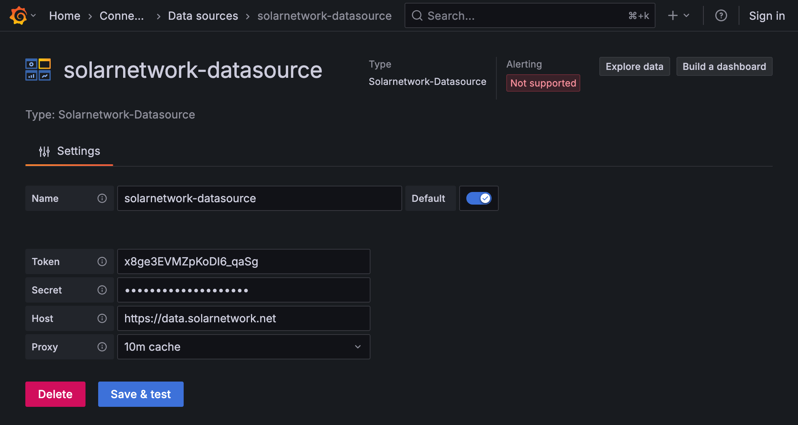
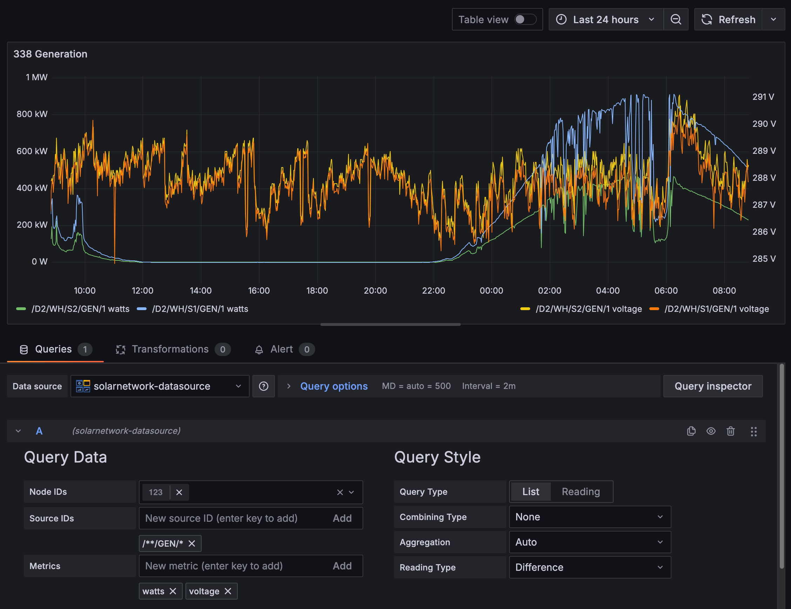

# SolarNetwork Grafana Data Source Plugin

This project provides a Grafana Data Source Plugin that allows you to visualize SolarNetwork
[datum](https://github.com/SolarNetwork/solarnetwork/wiki/SolarNet-API-global-objects#datum) stream
sample properties.

# Use

Configure the data source with your SolarNetwork API credentials:



Then you can configure queries using the data source, filling in the node IDs, source IDs, and metrics
([datum sample](https://github.com/SolarNetwork/solarnetwork/wiki/SolarNet-API-global-objects#datum-samples) properties):



## Query settings

The following settings are available on SolarNetwork queries:

| Setting        | Description                                                                                                                                                                                             |
| :------------- | :------------------------------------------------------------------------------------------------------------------------------------------------------------------------------------------------------ |
| Node IDs       | The node ID(s) to query. The available IDs for your configured data source credentials will be shown.                                                                                                   |
| Source IDs     | The source ID(s) to query. These can be [patterns](https://github.com/SolarNetwork/solarnetwork/wiki/SolarNet-API-global-objects#wildcard-patterns) or literal source ID values.                        |
| Metrics        | The [datum sample](https://github.com/SolarNetwork/solarnetwork/wiki/SolarNet-API-global-objects#datum-samples) properties to visualize.                                                                |
| Query Type     | The query API to use: [List](https://github.com/SolarNetwork/solarnetwork/wiki/SolarQuery-API#datum-list) or [Reading](https://github.com/SolarNetwork/solarnetwork/wiki/SolarQuery-API#datum-reading). |
| Combining Type | An optional [Combining Type](https://github.com/SolarNetwork/solarnetwork/wiki/SolarQuery-API-enumerated-types#combining-types), supported on the **List** query type.                                  |
| Aggregation    | The aggregation level to query. **Auto** will choose an appropriate value based on the query date range.                                                                                                |
| Reading Type   | For **Reading** query types, the [Reading Type](https://github.com/SolarNetwork/solarnetwork/wiki/SolarQuery-API-enumerated-types#datum-reading-types) to query.                                        |

# Development

## Getting started

### Backend

1. Update [Grafana plugin SDK for Go](https://grafana.com/developers/plugin-tools/key-concepts/backend-plugins/grafana-plugin-sdk-for-go) dependency to the latest minor version:

   ```bash
   go get -u github.com/grafana/grafana-plugin-sdk-go
   go mod tidy
   ```

2. Build backend plugin binaries for Linux, Windows and Darwin:

   ```bash
   mage -v
   ```

3. List all available Mage targets for additional commands:

   ```bash
   mage -l
   ```

### Frontend

1. Install dependencies

   ```bash
   npm install
   ```

2. Build plugin in development mode and run in watch mode

   ```bash
   npm run dev
   ```

3. Build plugin in production mode

   ```bash
   npm run build
   ```

4. Run the tests (using Jest)

   ```bash
   # Runs the tests and watches for changes, requires git init first
   npm run test

   # Exits after running all the tests
   npm run test:ci
   ```

5. Spin up a Grafana instance and run the plugin inside it (using Docker)

   ```bash
   npm run server
   ```

6. Run the E2E tests (using Playwright)

   ```bash
   # Spins up a Grafana instance first that we tests against
   npm run server

   # If you wish to start a certain Grafana version. If not specified will use latest by default
   GRAFANA_VERSION=11.3.0 npm run server

   # Starts the tests
   npm run e2e
   ```

7. Run the linter

   ```bash
   npm run lint

   # or

   npm run lint:fix
   ```

## Distributing your plugin

When distributing a Grafana plugin either within the community or privately the plugin must be signed so the Grafana application can verify its authenticity. This can be done with the `@grafana/sign-plugin` package.

_Note: It's not necessary to sign a plugin during development. The docker development environment that is scaffolded with `@grafana/create-plugin` caters for running the plugin without a signature._

### Initial steps

Before signing a plugin please read the Grafana [plugin publishing and signing criteria](https://grafana.com/legal/plugins/#plugin-publishing-and-signing-criteria) documentation carefully.

`@grafana/create-plugin` has added the necessary commands and workflows to make signing and distributing a plugin via the grafana plugins catalog as straightforward as possible.

Before signing a plugin for the first time please consult the Grafana [plugin signature levels](https://grafana.com/legal/plugins/#what-are-the-different-classifications-of-plugins) documentation to understand the differences between the types of signature level.

1. Create a [Grafana Cloud account](https://grafana.com/signup).
2. Make sure that the first part of the plugin ID matches the slug of your Grafana Cloud account.
   - _You can find the plugin ID in the `plugin.json` file inside your plugin directory. For example, if your account slug is `acmecorp`, you need to prefix the plugin ID with `acmecorp-`._
3. Create a Grafana Cloud API key with the `PluginPublisher` role.
4. Keep a record of this API key as it will be required for signing a plugin

### Signing a plugin

#### Using Github actions release workflow

If the plugin is using the github actions supplied with `@grafana/create-plugin` signing a plugin is included out of the box. The [release workflow](./.github/workflows/release.yml) can prepare everything to make submitting your plugin to Grafana as easy as possible. Before being able to sign the plugin however a secret needs adding to the Github repository.

1. Please navigate to "settings > secrets > actions" within your repo to create secrets.
2. Click "New repository secret"
3. Name the secret "GRAFANA_API_KEY"
4. Paste your Grafana Cloud API key in the Secret field
5. Click "Add secret"

##### Push a version tag

To trigger the workflow we need to push a version tag to github. This can be achieved with the following steps:

1. Run `npm version <major|minor|patch>`
2. Run `git push origin main --follow-tags`

### Learn more

Below you can find source code for existing app plugins and other related documentation.

- [Basic data source plugin example](https://github.com/grafana/grafana-plugin-examples/tree/master/examples/datasource-basic#readme)
- [`plugin.json` documentation](https://grafana.com/developers/plugin-tools/reference/plugin-json)
- [How to sign a plugin?](https://grafana.com/developers/plugin-tools/publish-a-plugin/sign-a-plugin)
