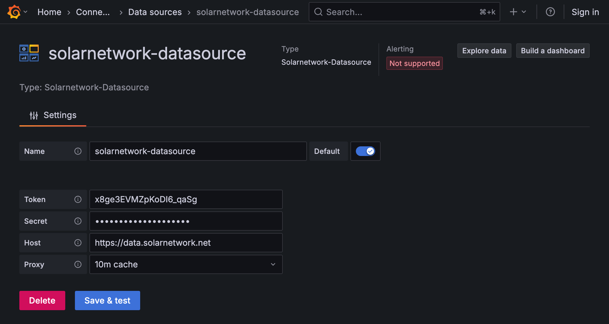
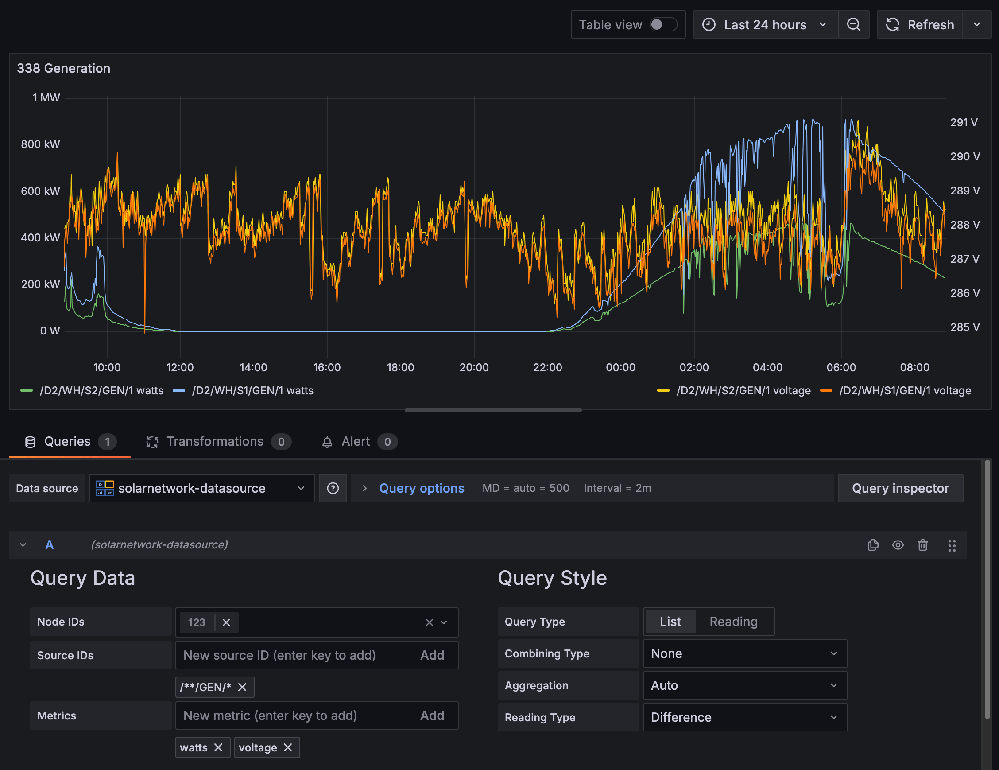

# SolarNetwork Datasource

This plugin provides a data source plugin that allows you to visualize
[datum](https://github.com/SolarNetwork/solarnetwork/wiki/SolarNet-API-global-objects#datum) stream
sample properties in [SolarNetwork](https://solarnetwork.net).

# Requirements

You will need valid SolarNetwork API credentials (a security token). You can manage tokens for your
own SolarNetwork account on the [Security
Tokens](https://data.solarnetwork.net/solaruser/u/sec/auth-tokens) page, or ask your SolarNetwork
integrator for a token to access your data.

# Use

Configure the data source with your SolarNetwork API credentials:

Then you can configure queries using the data source, filling in the node IDs, source IDs, and metrics
([datum sample](https://github.com/SolarNetwork/solarnetwork/wiki/SolarNet-API-global-objects#datum-samples) properties):

## Query settings

The following settings are available on SolarNetwork queries:

| Setting        | Description                                                                                                                                                                                             |
| :------------- | :------------------------------------------------------------------------------------------------------------------------------------------------------------------------------------------------------ |
| Node IDs       | The node ID(s) to query. The available IDs for your configured data source credentials will be shown.                                                                                                   |
| Source IDs     | The source ID(s) to query. These can be [patterns](https://github.com/SolarNetwork/solarnetwork/wiki/SolarNet-API-global-objects#wildcard-patterns) or literal source ID values.                        |
| Metrics        | The [datum sample](https://github.com/SolarNetwork/solarnetwork/wiki/SolarNet-API-global-objects#datum-samples) properties to visualize.                                                                |
| Query Type     | The query API to use: [List](https://github.com/SolarNetwork/solarnetwork/wiki/SolarQuery-API#datum-list) or [Reading](https://github.com/SolarNetwork/solarnetwork/wiki/SolarQuery-API#datum-reading). |
| Combining Type | An optional [Combining Type](https://github.com/SolarNetwork/solarnetwork/wiki/SolarQuery-API-enumerated-types#combining-types), supported on the **List** query type.                                  |
| Aggregation    | The aggregation level to query. **Auto** will choose an appropriate value based on the query date range.                                                                                                |
| Reading Type   | For **Reading** query types, the [Reading Type](https://github.com/SolarNetwork/solarnetwork/wiki/SolarQuery-API-enumerated-types#datum-reading-types) to query.                                        |
